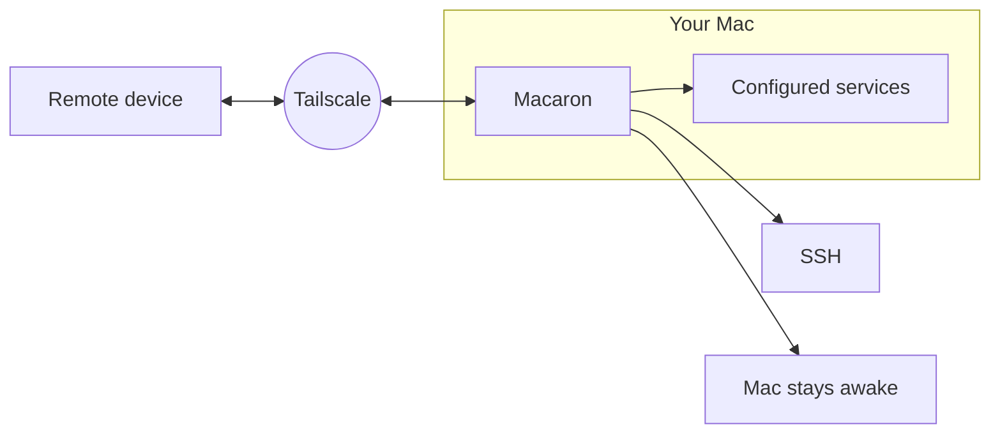

# Macaron

Macaron turns your Mac into a remote workstation.

It uses [Tailscale][tailscale] to make your Mac reachable from your private
network, keeps it awake, enables SSH, and starts the services you configure.



```sh
curl -L https://raw.githubusercontent.com/clemenzi/macaron/refs/heads/main/install.sh | bash
```

## Requirements

- macOS
- Tailscale installed, authenticated, and available on `PATH`
- `sudo` access
- Any dependencies required by your services

## Usage

Start Macaron from the project directory:

```sh
./macaron
```

It will:

- enable Remote Login;
- temporarily disable sleep;
- run `tailscale up`;
- start the configured services;
- print the SSH address and service URLs.

Run the environment and configured-service checks without starting the
workstation. The command exits non-zero if any check fails:

```sh
./macaron doctor
```

Press `Ctrl-C` to stop Macaron. Remote Login, sleep, and Tailscale are restored
to the state they had before startup. Services are started in the background
and are not stopped by Macaron.

## Services

Macaron starts every executable named `start` inside the global configuration
directory, `$XDG_CONFIG_HOME/macaron/services/` (or
`~/.config/macaron/services/` when `XDG_CONFIG_HOME` is not set):

```text
~/.config/macaron/services/
└── my-service/
    └── start
```

`start` can be a shell script, a compiled binary, or any other executable.
Macaron runs services in alphabetical order and assigns ports starting at
`49001`. Each service receives its port through:

```text
MACARON_AVAILABLE_PORT
```

For example, a service can use `$MACARON_AVAILABLE_PORT` to bind its HTTP
server. Macaron prints the resulting URL using the Mac's Tailscale IP.

## License

[MIT](LICENSE)

[tailscale]: https://tailscale.com/
