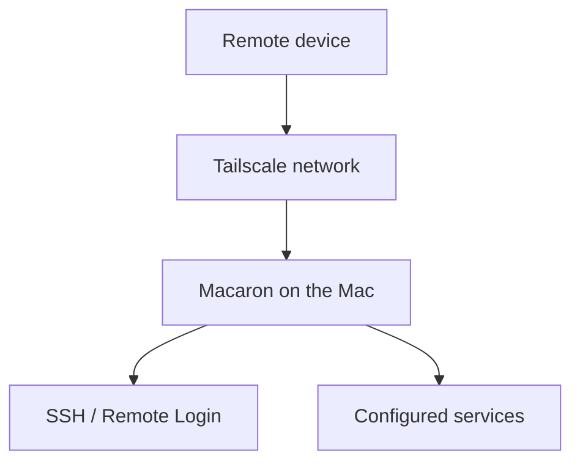

# Macaron

Macaron prepares a Mac for remote access and starts available services through
the [Tailscale][tailscale] network.

When started, Macaron:

1. requests `sudo` authorization;
2. temporarily enables **Remote Login** (SSH);
3. temporarily disables Mac sleep;
4. runs `tailscale up`;
5. starts the `start` scripts in `services/<service-name>/`;
6. stays running to keep the remote environment active.

When Macaron receives `Ctrl-C` or a termination signal, it restores the
previous state of Remote Login, sleep, and Tailscale.



## Requirements

- macOS;
- [Tailscale][tailscale] installed, authenticated, and available on `PATH`;
- an account authorized to use `sudo`.

## Usage

From the project directory:

```sh
./macaron
```

The default command is `start`. To quickly check whether Tailscale is running:

```sh
./macaron doctor
```

After startup, Macaron prints the SSH address and service URLs using the
machine's IPv4 address on the Tailscale network:

```text
ssh <username>@<tailscale-ip>
http://<tailscale-ip>:49001
```

## Services

Macaron looks for executable `services/*/start` scripts. For each script, it:

- assigns a port starting at `49001`, ordered alphabetically by directory;
- passes the port through the `MACARON_AVAILABLE_PORT` environment variable;
- considers the service started if the script exits successfully.

Macaron has no service-specific requirement. A service runs whenever its
executable startup script is present inside `services/<service-name>/`.

To add a service, create a directory containing an executable `start` script,
for example:

```text
services/my-service/start
```

The script should use `$MACARON_AVAILABLE_PORT` for its assigned port.

## Runtime behavior

Service scripts are started in the background, and Macaron does not stop them
when it exits. If Tailscale was stopped before startup, Macaron restores it to
the stopped state during cleanup; services that were already started may remain
active locally but will no longer be reachable through Tailscale.

Macaron changes system settings with `sudo systemsetup` and `sudo pmset`. Stop
it with `Ctrl-C` to trigger restoration of the previous settings.

## License

[MIT](LICENSE)

[tailscale]: https://tailscale.com/
